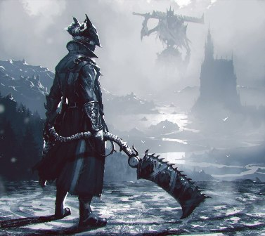

##    Alexander Dmitrov

- ***Contacts:***
    - __Discord:__  Atzak(@gamesam88)
    - __Github:__ [gamesam88](https://github.com/gamesam88 "Github")
- ***About me:*** <br>
    &nbsp;My goal in this course is to improve my knowledge in  Frontend development, <br>
    as well as to find like-minded people. At the moment I don't have much experience <br>
    in development, but I like doing it and I'm learning new things pretty quickly. <br>
- ***My skills:***
    - HTML5
    - CSS3
    - JavaScript
    - Figma
    - Git
- ***Code example:***<br>
    ```
    function minValue(values){
    return Number([...new Set(values)].sort((a,b)=>a-b).join(""))
    }
    ```
- ***My works:***
    - [Tribute Page](https://github.com/gamesam88/Tribute-Page.git "Tribute-Page")
    - [Rsschool CV](https://github.com/gamesam88/rsschool-cv.git "rsschool-cv")
- ***Education:***
    - FreeCodeCamp
    - The Rolling Scopes School
    - CS50
    - English Galaxy
- ***Language:***
    - Russian (native)
    - English (A2)
