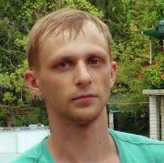

##    Alexander Dmitrov
**********

- ***Contacts:***
    - __Email:__ dyxpp88@gmail.com
    - __Github:__ https://github.com/gamesam88
    - __Discord:__  Atzak
- ***About me:***
     My goal in this course is to improve my knowledge in  Frontend development, <br>
    as well as to find like-minded people. At the moment I don't have much experience <br>
    in development, but I like doing it and I'm learning new things pretty quickly. <br>
- ***My skills:***
    - HTML5
    - CSS3
    - JavaScript
    - Figma
    - Git
- ***Code example:***<br>
    ```
    function minValue(values){
    return Number([...new Set(values)].sort((a,b)=>a-b).join(""))
    }
    ```
- ***My works:***
    - https://github.com/gamesam88/Tribute-Page.git
    - https://github.com/gamesam88/rsschool-cv.git
- ***Corses:***
    - FreeCodeCamp
    - CS50
    - English Galaxy
- ***Language:***
    - Russian (native)
    - English (A2)

